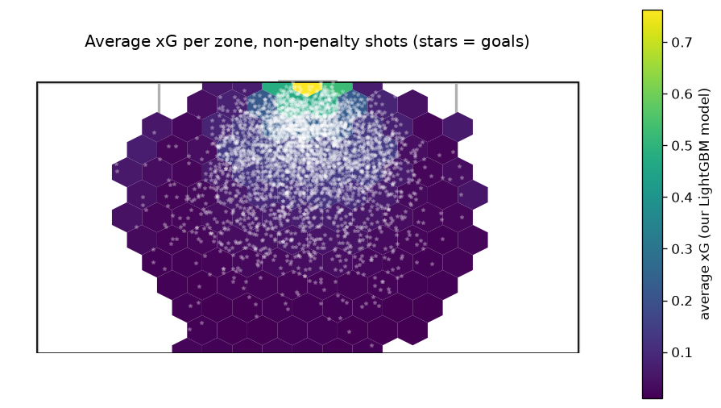

# xG Lab

An expected-goals (xG) model built only from free data. It was trained on every shot of the 2015/16 Premier League, La Liga, Serie A and Ligue 1 (37,881 shots), then tested on recent major tournaments it never saw. On those tournaments it **matches StatsBomb's commercial xG model to within about 0.005 log loss**.

**Interactive app:** shot maps, an xG calculator and finishing over- and under-performers. Run it with `streamlit run app.py`; it's deployed on Streamlit Community Cloud.

## This season (2026/27): xG-lite for the top-5 leagues

No free, permitted source has current shot-by-shot xG, so the app estimates it. TheSportsDB's free API gives shots inside and outside the box for each match, and each zone gets the value of an average shot taken there, measured on our StatsBomb data:
- **Weights:** 0.140 xG per inside-box shot and 0.034 per outside-box shot.
- **Stability:** recent tournaments gave nearly the same values (0.135 / 0.032).
- **Validation:** on WC 2022, Euro 2024 and Copa 2024, team xG-lite totals correlate **0.96** with full xG and predict goals almost as well (r = 0.754 vs 0.784).
- **Update cadence:** a daily GitHub Action (`xg/season_fetch.py`) adds new matches.
- **Limitation:** the Champions League has no free shot data.
- **Real xG upgrade:** [Highlightly](https://highlightly.net)'s free plan (100 requests/day) includes **real match xG**, expected assists, big chances and possession for the top-5 leagues and the Champions League. `xg/hl_fetch.py` collects it daily within the quota, and each league's table switches from xG-lite to real xG once 90% of its finished matches are in. Sources are never mixed within one table.

## Out-of-sample test: recent tournaments

| Tournament | Shots | Goals | Our xG | StatsBomb xG | Log loss, ours / StatsBomb (↓) | AUC, ours / StatsBomb (↑) |
|---|---|---|---|---|---|---|
| World Cup 2022 | 1,428 | 152 | 145.9 | 137.9 | 0.268 / 0.267 | 0.813 / 0.814 |
| Euro 2024 | 1,300 | 98 | 115.3 | 111.4 | 0.228 / 0.226 | 0.780 / 0.786 |
| Copa América 2024 | 741 | 63 | 67.4 | 66.0 | 0.244 / 0.241 | 0.784 / 0.790 |

These are non-penalty shots; penalties use a fixed xG of 0.76.

## The model

- **Features (29):**
  - **Geometry:** distance and angle to goal.
  - **The shot itself:** header vs foot, technique (volley, lob…), first time, under pressure, one-on-one, free kick.
  - **Build-up:** play pattern (counter, set piece) and assist type (through ball, cross, cut-back).
  - **Where everyone stood** at the moment of the shot (StatsBomb freeze frames): defenders in the shot cone, opponents close to the shooter, and the goalkeeper's position.
- **Model:** a 50/50 blend of LightGBM and a standardised logistic regression.
- **On held-out 2015/16 matches:** log loss 0.2437 vs StatsBomb's 0.2424. A paired bootstrap over matches finds the gap not statistically distinguishable (95% CI −0.0013 to +0.0040).
- **Most informative single feature:** the goalkeeper's distance to the shooter.
- **Leakage guards:**
  - the train/test split is by match;
  - early stopping uses a validation set carved from the training matches;
  - StatsBomb's own xG is used only as a benchmark, never as a feature.

## Run it yourself

```bash
pip install -r requirements.txt pandas scikit-learn mplsoccer statsbombpy matplotlib requests
python statsbomb.py        # download 2015/16 events (~400 MB gzipped) -> data/
python xg/eda.py           # exploration + shot map
python xg/baseline.py      # distance + angle baseline
python xg/features.py      # feature ablation
python xg/model.py         # final model, bootstrap vs StatsBomb, heatmap
python xg/tournaments.py   # test on World Cup 2022 / Euro 2024 / Copa America 2024 -> xg/app_data/
streamlit run app.py
```



## Data

Data provided by [StatsBomb Open Data](https://github.com/statsbomb/open-data). Current-season match data: [TheSportsDB](https://www.thesportsdb.com) free API. Only small derived tables (per-shot xG for the three tournaments) are included here; raw data is downloaded by `statsbomb.py`.

Why no current club season? In 2026 there's no free source of current shot-level xG that permits automated access: Understat and FotMob disallow bots, and FBref lost its xG in January 2026. StatsBomb's tournaments are the newest free, permitted shot data.
